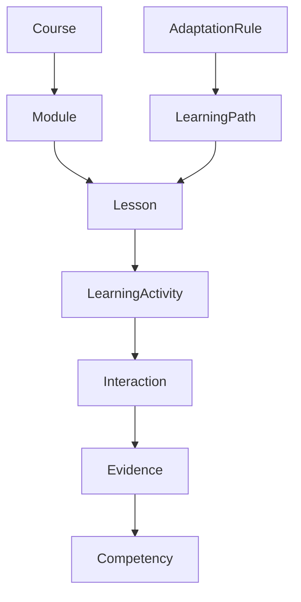

# EduInteractive - Learning Object Model (LOM)

This document defines the core domain entities (`LearningObjects`) that constitute the EduInteractive ecosystem. This model follows Domain-Driven Design principles, representing the "living" components of our Learning Runtime.

---

## 1. Learning Object Taxonomy

| Level | Category | Key Entities |
| :--- | :--- | :--- |
| **L1** | **Structural** | `Course`, `Module`, `Lesson` |
| **L2** | **Execution** | `LearningActivity`, `Interaction`, `Simulation` |
| **L3** | **Evidence** | `Attempt`, `Submission`, `Evidence`, `Reflection` |
| **L4** | **Intelligence** | `Competency`, `LearningOutcome`, `MasteryLevel` |
| **L5** | **Orchestration** | `LearningPath`, `AdaptationRule` |

---

## 2. Relationship Graph

---

## 3. Entity Specification (Representative: `LearningActivity`)

The `LearningActivity` is an aggregate root that orchestrates a specific learning goal execution.

*   **Purpose:** To encapsulate a specific instructional goal, its associated interactions, and the resulting assessment metrics.
*   **Owner:** Content Creator / Teacher (via Teacher Studio).
*   **State:** `[Draft, Published, Active, Archived]`
*   **Lifecycle:** `Draft` -> `Published` -> `Active` -> `Archived`
*   **Output:** `ActivityCompleted` event, `Evidence` instances.
*   **Events Produced:** `ActivityStarted`, `ActivityCompleted`.

---

## 4. Event Binding & Object Mapping

| Object | Events Emitted | Primary Software Service |
| :--- | :--- | :--- |
| `Lesson` | `LessonStarted`, `LessonCompleted` | `LessonEngine` |
| `LearningActivity` | `ActivityStarted`, `ActivityCompleted` | `ActivityEngine` |
| `Interaction` | `AnswerSubmitted` | `InteractionEngine` |
| `Evidence` | `EvidenceCreated` | `EvidenceRepository` |
| `Competency` | `CompetencyUpdated` | `CompetencyEngine` |

---

## 5. Software Translation Layer

This layer maps the domain entities directly to future software infrastructure components.

| Domain Entity | Infrastructure Component (Service/Module) | Responsibility |
| :--- | :--- | :--- |
| `Lesson` | `LessonRuntimeService` | Orchestrates lesson-level transitions. |
| `LearningActivity` | `ActivityRuntimeService` | Manages specific pedagogical activity logic. |
| `Evidence` | `EvidencePersistenceService` | Immutable storage of learning proofs. |
| `Competency` | `CompetencyCalculationService` | Aggregates mastery levels over time. |
| `LearningPath` | `PathOrchestratorService` | Determines next logical activity based on events. |
