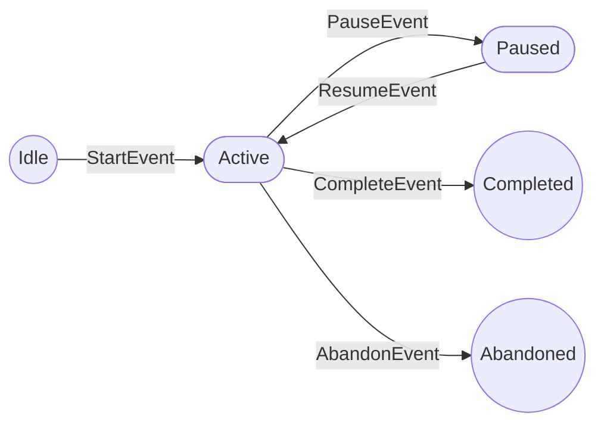

# EduInteractive - Learning Runtime Architecture Blueprint

This document defines the core operational architecture of the EduInteractive platform, focusing on the real-time execution of learning activities.

---

## Layer 0: Event Backbone System

The Event Backbone is the central nervous system of EduInteractive. It facilitates asynchronous, event-driven communication between all specialized engines.

### Event Definitions & Consumers

| Event | Definition | Primary Consumer |
| :--- | :--- | :--- |
| `LearningSessionStarted` | A new learning session is initialized. | LearningRuntimeEngine, Analytics |
| `VideoPlaybackStarted` | Video content playback begins. | Analytics, BehaviorEngine |
| `CheckpointTriggered` | Student reaches a pre-defined point. | InteractionEngine |
| `InteractionPresented` | An activity/question is shown to user. | InteractionEngine |
| `AnswerSubmitted` | User submits an interaction response. | AssessmentEngine |
| `AnswerEvaluated` | Response is validated by the system. | EvidenceEngine, FeedbackEngine |
| `EvidenceGenerated` | Concrete learning proof is created. | EvidenceRepository, CompetencyEngine |
| `CompetencyUpdated` | Student mastery level is updated. | CompetencyEngine, RecommendationEngine |
| `HintRequested` | Student requests AI guidance. | AICollaborationEngine |
| `LessonCompleted` | Final state of lesson reached. | LearningRuntimeEngine, Analytics |
| `ReflectionSubmitted` | Student reflection captured. | EvidenceEngine |
| `RecommendationGenerated` | AI suggests next activity. | LearningRuntimeEngine |

---

## Layer 1: Learning Runtime Engine

The `LearningRuntimeEngine` (LRE) is the orchestrator for all active `LearningSessions`. It acts as a stateful processor that consumes events and enforces the pedagogical state machine.

### 1. Real-time Execution Model

The LRE does not follow a linear flowchart. It operates as an **Event-Loop Orchestrator**:
1.  **Event Ingestion:** LRE subscribes to the Event Backbone.
2.  **State Lookup:** Retrieves the current `LearningSession` state from the cache (fast access).
3.  **Rule Evaluation:** Applies pedagogical transition rules (e.g., "Cannot proceed if Interaction-A is not completed").
4.  **State Transition:** Updates the `LearningSession` state (e.g., `NOT_STARTED` -> `IN_PROGRESS`).
5.  **Event Emission:** Emits consequential events (e.g., if a lesson is completed, emit `LessonCompleted`).

### 2. Learning Session State (`LearningSessionEntity`)

| Property | Description |
| :--- | :--- |
| `sessionId` | Unique Identifier. |
| `currentState` | `[NOT_STARTED, IN_PROGRESS, PAUSED, COMPLETED, ABANDONED]` |
| `currentObjectId` | Pointer to the active `LearningObject` (Activity/Lesson). |
| `progressMap` | Map of completed interactions and their status. |
| `competencyState` | Aggregate of current competency levels for this session. |
| `evidenceList` | References to generated evidence in the session. |

### 3. State Machine Diagram

### 4. Transition Rules

| Event | Current State | Allowed? | New State | Condition |
| :--- | :--- | :--- | :--- | :--- |
| `StartEvent` | `Idle` | Yes | `Active` | None |
| `PauseEvent` | `Active` | Yes | `Paused` | None |
| `AnswerSubmitted` | `Active` | Yes | `Active` | `currentObjectId` must be an interaction. |
| `CompleteEvent`| `Active` | Yes | `Completed` | All mandatory objects in `LearningPath` must be fulfilled. |

---
