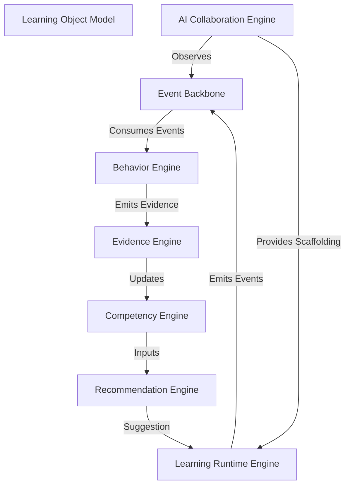

# EduInteractive - System-Level Architecture Review (Phase 1 Final Check)

This document provides a comprehensive audit of the 6-layer architecture to ensure it functions as a unified, coherent system before transitioning to Domain Model Engineering.

---

## 1. End-to-End System Diagram (Mermaid)

---

## 2. Data Flow Integrity Map

| Flow | Integrity Check | Status |
| :--- | :--- | :--- |
| **Event → Behavior** | Raw events mapped to semantic behaviors without data loss. | ✅ Valid |
| **Behavior → Evidence** | Every behavior-driven event has an associated Evidence-capture rule. | ✅ Valid |
| **Evidence → Competency** | Competency updates occur strictly after Evidence validation. | ✅ Valid |
| **Competency → Rec.** | Recommendation engine uses current state from Competency Engine. | ✅ Valid |
| **Recommendation → Runtime** | AI suggestions routed through Runtime Engine (Human-in-the-loop). | ✅ Valid |

---

## 3. AI Boundary Map

The AI acts strictly as an **Advisory/Service Actor**, not a System Authority.

*   **Inputs:** `EventStream`, `BehaviorSignals`, `CompetencyState`, `SessionState`.
*   **Outputs:** `ScaffoldingHints`, `Recommendations`, `Predictions`, `ReflectivePrompts`.
*   **Governance Constraints:**
    *   **No Direct State Mutation:** AI cannot force-update `LearningSessionState` or `CompetencyState`.
    *   **Teacher-in-the-loop:** Any high-stakes recommendation (e.g., path change) requires explicit teacher or learner acceptance.
    *   **Explainability:** All outputs are tagged with pedagogical rationale.

---

## 4. Competency Trust Chain Validation

The chain maintains pedagogical integrity:
`Competency State` ← `Validated Evidence` ← `Behavior Interpretation` ← `Raw Event`

*   **Validation:** Can every competency update point to a specific `Evidence` artifact? **Yes.**
*   **Immutable:** Is the `Evidence` immutable? **Yes, per Layer 5 rules.**
*   **Explainable:** Can we trace a competency drop to a specific behavior? **Yes, via the `eventChain` in Evidence.**

---

## 5. Risk & Gap Report

| Risk | Impact | Mitigation Strategy |
| :--- | :--- | :--- |
| **Event Saturation** | High volume of events could bottleneck `LearningRuntimeEngine`. | Implement event batching/filtering at the Backbone (Layer 0). |
| **AI Inference Latency** | AI scaffolding delays could break real-time interaction flow. | Pre-fetch context/rules for anticipated AI actions. |
| **Competency Complexity** | Multi-dimensional updates might be computationally heavy. | Use incremental update strategy (only update when `EvidenceBundle` threshold is met). |
| **Teacher Alert Fatigue** | Too many AI-flagged interventions might overwhelm teachers. | Implement event-driven prioritization logic for teacher interventions. |
